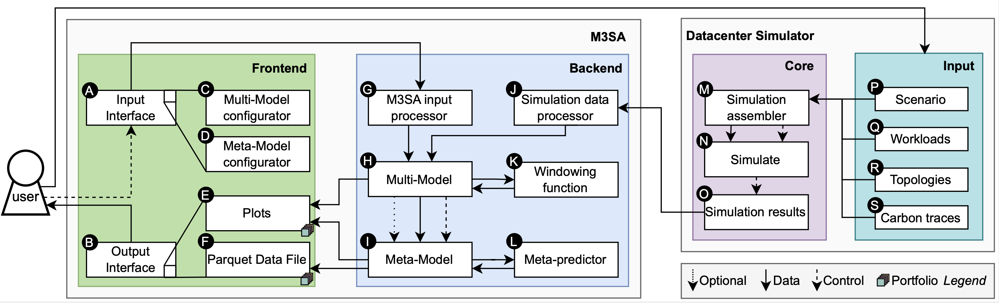

# M3SA

Multi- and Meta-Model Simulation and Analysis for ICT infrastructure.

---

**Contents**

-   [Abstract](#abstract)
-   [Repository Structure](#repository-structure)
-   [M3SA Architecture](#m3sa-architecture)
-   [Reproducibility capsule](#reproducibility-capsule)
-   [Open Science](#open-science)
-   [License](#license)

---

## Abstract

Datacenters are vital for the digital society but represent a considerable fraction of global energy consumption. To improve their sustainability and performance when demand is foreseen to increase, we envision simulators and simulation-based digital twins will become primary decision-making tools. However, unlike other fields focusing on key societal infrastructure such as waterworks and mass transit, datacenter simulators cannot yet combine multiple, independent models into their operation. Addressing this challenge, in this work we propose M3SA, a datacenter simulation and analysis framework that uses discrete-event simulation to predict, per model and combined into a Meta-Model, the impact on climate and performance of various realistic datacenter conditions. We design an architecture for simulating with multiple concurrent models, a technique to integrate the results of multiple models into a Meta-Model, and a procedure to evaluate the accuracy of the Meta-Model.

## Repository Structure

-   [`m3sa/`](m3sa) - M3SA independent tool
-   [`m3sa-opendc/`](m3sa-opendc) - M3SA coupled with OpenDC
-   [`reproducibility-capsule`](reproducibility-capsule) - Reproducibility capsule of the experiments in the paper
-   [`M3SA-technical-report.pdf`](M3SA-technical-report.pdf) - Technical report of the paper
-   [`m3sa-tutorial.md`](m3sa-tutorial.md) - Tutorial on how to use M3SA, coupled and decoupled with a simulator
-   [`README.md`](README.md) - _you are here_
-   [`LICENSE`](LICENSE) - License file (MIT, Open Science)
-   others (e.g., [`m3sa-architecture.png`](m3sa-architecture.png), [`.gitignore`](.gitignore), etc.)

## M3SA Architecture



We design M3SA to be capable of operating coupled or decoupled from a datacenter simulator. The figure above depicts an overview of the system's architecture, in which M3SA extends a black-boxed simulator. We couple M3SA with OpenDC, a peer-reviewed, open-source, discrete-event simulator with simple interfaces, and over 5 years of development and operation.

The user interacts with the system through the Input Interface (A) and Output Interface (B) interfaces. The M3SA process begins with the user configuring the Multi-Model (C) and the Meta-Model (D). The simulation process is triggered and controlled by the M3SA backend, occurring between (M)-(S): the system sets up a simulation based on user input, simulates, and centralizes predictions. The simulation block (M)-(S) reflects the operation of discrete-event simulators commonly used in the field, similar to the architectures of OpenDC and CloudSim; specifically, the simulation assembler (M) is where single models are typically defined in current experiments.

## Reproducibility capsule
The reproducibility capsule runs all the experiments and generates the results and relevant figures from the paper.
To reduce overhead, we reduced reproducibility to **only 2 commands**. The reproducibility capsule run Dockerized,
has been tested on macOS and Linux, and runs for 8-10 minutes, as measured on a MacBook M2 Pro.

### Dependencies
Docker (20.10 or higher)

### Step 1
**Enter the correct directory**
```bash
  cd reproducibility-capsule
```

### Step 2
**Run all (figures and experiments)**
```bash
  make run
```

### Results
- After step 2, figures are available in `reproducibility-capsule/results/figure-exports`.

- After step 2, raw-results are available in `reproducibility-capsule/results`.

### Running a specific experiment / figure
`make run-<experiment/figure>`

possible values: "figure4", "figure6", "experiment1", "experiment2", "experiment3"

e.g., `make run-figure4`

### Figure 4
- ~2 minutes running time*
- figures in `reproducibility-capsule/figure-exports` (Figures 4A, 4B, 4C)
- raw results in `reproducibility-capsule/results/figure4`

### Figure 6
- ~a few blinks of an eye*
- figures in `reproducibility-capsule/figure-export/` (Figures 6A, 6B, 6C)
- raw results in `reproducibility-capsule/results/figure6`

### Experiment 1 
- ~2 minutes running time*
- figures in `reproducibility-capsule/figure-exports` (Figures 9A, 9B, 9C)
- raw results in `reproducibility-capsule/results/experiment1`

### Experiment 2
- ~ 5 minutes running time*
- figures in `reproducibility-capsule/figure-exports` (Figures 12A, 12B, 12C, 12D)
- raw results in `reproducibility-capsule/results/experiment2`

### Experiment 3
- ~ 1-2 minutes dependency setup (automatic installation)*
- ~a few blinks of an eye* running time
- figures in `reproducibility-capsule/figure-exports` (Figures 14, 15, 16, 17)
- raw results in `reproducibility-capsule/results/experiment3`

_*all running times have been measured on a 2023 MacBook Pro with an M2 Pro chip and 16 GB of RAM._

### Optional: clean
Delete all the files generated by the reproducibility capsule.
```bash
  make clean
```

## Open Science
We provide M3SA as open-source software, under the MIT license. Together with M3SA, we make open-source the trace archive 
used throughout the experiments.  Double-blinded submission link: https://anonymous.4open.science/r/trace-archive/.

## License

M3SA is distributed under the MIT license. See [LICENSE](/LICENSE).
